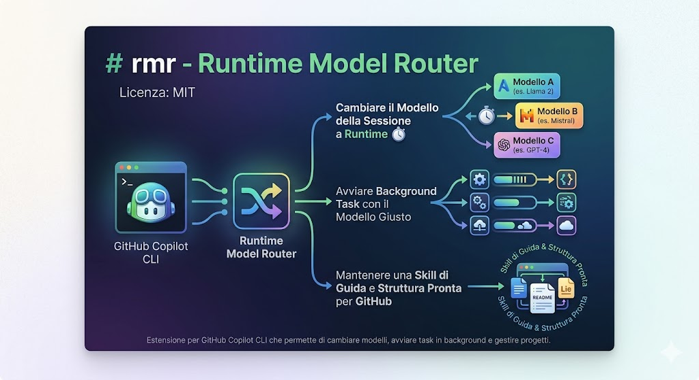

# rmr · Runtime Model Router




Estensione per **GitHub Copilot CLI** che permette di cambiare il modello della sessione a runtime e di avviare background task scegliendo, per ciascuno, il modello più adatto al tipo di lavoro. Include una skill di guida 

Ispirato all'idea di poter "passare ferro" al modello giusto in base al task (codice, review, scripting), senza riavviare la sessione né perdere il contesto.

## Indice

- [Cosa fa](#cosa-fa)
- [Struttura del repository](#struttura-del-repository)
- [Installazione](#installazione)
- [Uso](#uso)
  - [Slash command](#slash-command)
  - [Preset modello](#preset-modello)
  - [Background task](#background-task)
- [Modello di configurazione](#modello-di-configurazione)
- [Skill di guida](#skill-di-guida)
- [Disinstallazione](#disinstallazione)
- [Documentazione](#documentazione)
- [Note di design](#note-di-design)
- [Estensioni naturali](#estensioni-naturali)
- [Licenza](#licenza)

## Cosa fa

- **Cambio modello a runtime** della sessione Copilot CLI senza riavvio.
- **Background task model-aware** — un task lanciato in background gira col modello giusto per quel lavoro (es. `review` su un modello da ragionamento, `script` su uno snello).
- **Preset configurabili** in un solo file JSON (`presets.json`) — niente alias sparsi per il repo.
- **Skill di guida integrata** che documenta i comandi e i preset direttamente dentro Copilot.

## Struttura del repository

```
rmr/
├── .github/extensions/rmr/
│   ├── extension.mjs          # entry-point dell'estensione Copilot CLI
│   └── presets.json           # mappatura preset → modello
├── skills/rmr/
│   └── SKILL.md               # guida invocabile da Copilot
├── scripts/
│   ├── install.sh             # installazione one-shot
│   └── uninstall.sh           # rimozione pulita
├── docs/
│   ├── INSTALLAZIONE.md
│   ├── USO.md
│   ├── ARCHITETTURA.md
│   └── VALIDAZIONE.md
├── LICENSE
└── README.md
```

## Installazione

```bash
bash scripts/install.sh
```

Lo script copia `extension.mjs` e `presets.json` nella directory delle estensioni di Copilot CLI e registra la skill `rmr`. Dopo l'installazione, riavviare Copilot CLI o lanciare `/clear` per ricaricare le estensioni.

Per dettagli su percorsi, permessi e troubleshooting → [`docs/INSTALLAZIONE.md`](docs/INSTALLAZIONE.md).

## Uso

### Slash command

| Comando | Effetto |
|---------|---------|
| `/rmr-status` | Mostra il modello corrente della sessione e i preset disponibili. |
| `/rmr-model <preset>` | Cambia il modello della sessione applicando il preset indicato. |
| `/rmr-bg <preset> <agent> "<prompt>"` | Avvia un background task con il preset specificato. |

### Preset modello

I preset sono definiti in `.github/extensions/rmr/presets.json`. La distribuzione include:

| Preset | Caso d'uso |
|--------|------------|
| `code` | Generazione e refactoring di codice. |
| `review` | Code review, ragionamento approfondito, analisi di sicurezza. |
| `script` | Scripting rapido, automazioni, task brevi e a basso costo. |

Esempi:

```bash
# Stato corrente
/rmr-status

# Switch al preset "review" per una sessione di code review
/rmr-model review

# Switch al preset "script" per task rapidi
/rmr-model script

# Background task: review con agent "rubber-duck"
/rmr-bg review rubber-duck "Analizza il router runtime"
```

### Background task

`/rmr-bg` instrada il task verso il modello associato al preset, indipendentemente dal modello della sessione interattiva. Utile per non bloccare la sessione corrente su un'analisi lunga, o per delegare un compito a un modello più adatto.

## Modello di configurazione

Un singolo file di preset, versionato col repo:

```jsonc
// .github/extensions/rmr/presets.json
{
  "presets": {
    "code":   { "model": "gpt-5-codex" },
    "review": { "model": "claude-opus-4-6" },
    "script": { "model": "claude-haiku-4-5" }
  },
  "default": "code"
}
```

Modificare il file e ricaricare l'estensione (`/clear`) per applicare nuovi preset. Nessun file `.rmr.json` per repository — la configurazione vive in un unico posto.

## Skill di guida

`skills/rmr/SKILL.md` viene registrata come skill Copilot al momento dell'installazione. Da dentro Copilot CLI è possibile invocarla in linguaggio naturale:

> "mostrami i preset disponibili in rmr"
> "spiegami come funziona /rmr-bg"

La skill restituisce documentazione contestuale senza dover aprire il README.

## Disinstallazione

```bash
bash scripts/uninstall.sh
```

Rimuove estensione, preset e registrazione della skill. Non tocca eventuali modifiche manuali a `presets.json`: lo script avvisa prima di sovrascrivere.

## Documentazione

| Documento | Contenuto |
|-----------|-----------|
| [`docs/INSTALLAZIONE.md`](docs/INSTALLAZIONE.md) | Procedura dettagliata, percorsi per OS, troubleshooting. |
| [`docs/USO.md`](docs/USO.md) | Tutti gli slash command con esempi reali. |
| [`docs/ARCHITETTURA.md`](docs/ARCHITETTURA.md) | Come `extension.mjs` si integra con Copilot CLI e come i preset vengono risolti. |
| [`docs/VALIDAZIONE.md`](docs/VALIDAZIONE.md) | Test manuali e smoke test per validare l'installazione. |

## Note di design

- **Switch a runtime, non a riavvio** — il cambio modello agisce sulla sessione corrente. Nessun restart, nessuna perdita di contesto.
- **Preset > alias sparsi** — un solo file JSON versionato evita la deriva di configurazioni per-repo.
- **Background task con modello esplicito** — il preset passato a `/rmr-bg` ha la precedenza sul modello della sessione: utile per delegare ragionamento pesante senza degradare i task interattivi.
- **Skill auto-documentante** — la guida vive accanto al codice, non in una wiki esterna che invecchia.

## Estensioni naturali

- `/rmr-preset add <nome> <modello>` per aggiungere preset senza editare il JSON a mano.
- Preset per provider multipli (Anthropic, OpenAI, locali via Ollama) con fallback automatico.
- Logging delle scelte di modello per analisi a posteriori (quale preset usi davvero?).
- Hook pre/post switch per notifiche o validazioni.

## Licenza

MIT — Copyright © 2026 Paolino Salamone.
